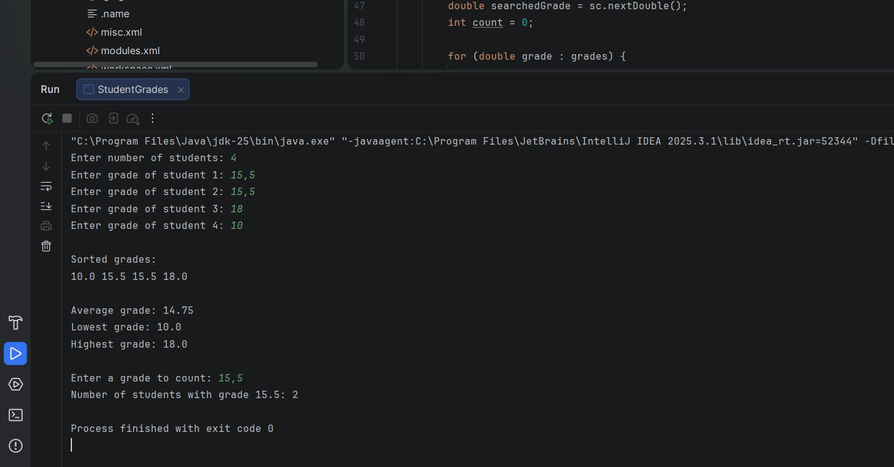
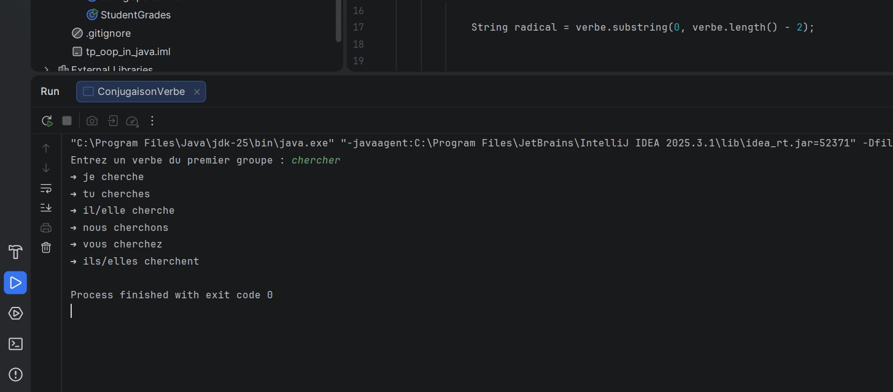
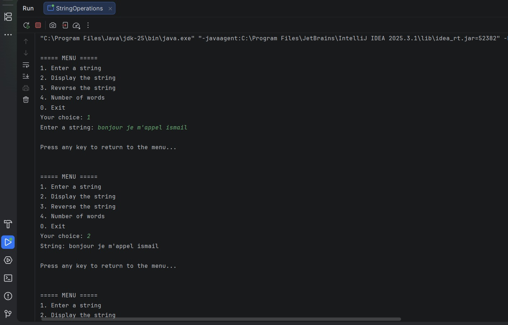
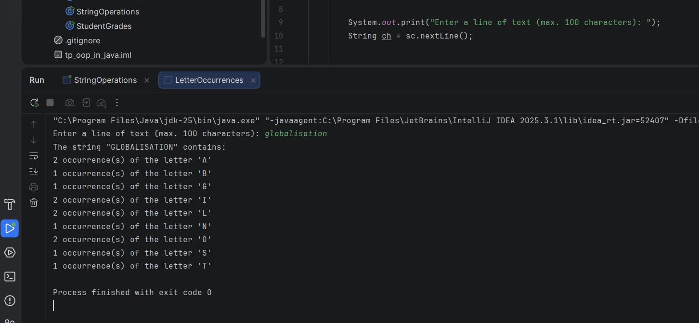

# Java Practical Work (TP)

Name: Ismail Baakrime  
Field of Study: SDIA
Subject: Java Practical Work (Strings, Arrays, Menu)

---

## Exercise 1: Student Grades Management

### Problem Description
This program reads student grades from the keyboard and stores them in an array.
It allows the following operations:
- Sorting and displaying grades
- Calculating the average grade
- Displaying the highest and lowest grades
- Counting the number of students having a specific grade

### Solution
The grades are stored in an array. The program uses `Arrays.sort()` to sort the grades,
loops to compute the average, and comparisons to find the minimum and maximum values.

### Program Execution
Below is an example of the program execution:

---

## Exercise 2: First Group Verb Conjugation

### Problem Description
This program reads a French verb from the keyboard and checks if it belongs to the first group
(ending with "er"). It then displays its conjugation in the present tense.

### Solution
The program verifies the ending of the verb, extracts the stem, and adds the appropriate
present tense endings for each personal pronoun.

### Program Execution

---

## Exercise 3: String Operations

### Problem Description
This program displays a menu allowing the user to perform several operations on a string:
- Enter a string
- Display the string
- Reverse the string
- Count the number of words

### Solution
A menu controlled by a loop is used. String manipulation methods and loops are applied
to perform each operation.

### Program Execution

---

## Exercise 4: Letter Occurrences

### Problem Description
This program reads a string and counts the occurrences of each letter of the alphabet
without distinguishing between uppercase and lowercase letters.

### Solution
A 26-element array is used to store the number of occurrences of each letter. The string
is converted to uppercase to simplify counting.

### Program Execution

